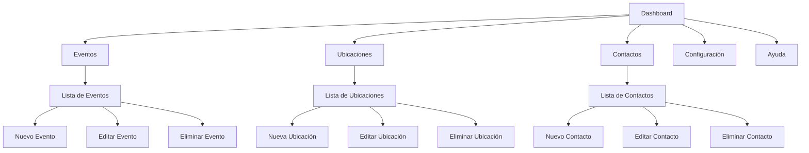

# Informe Técnico
## Sistema de Gestión de Eventos - Institución Educativa

**Versión:** 1.0  
**Fecha:** Diciembre 2024  
**Repositorio:** https://github.com/Jona95M/casop1  
**Aplicación en Producción:** https://casop1.onrender.com

---

## 1. Introducción

Este documento presenta el informe técnico del Sistema de Gestión de Eventos desarrollado para una institución educativa. El sistema permite registrar, gestionar y consultar eventos (conferencias, talleres, seminarios), ubicaciones y contactos, siguiendo los principios de Interacción Hombre-Máquina (HCI).

### 1.1 Tecnologías Utilizadas

| Tecnología | Propósito |
|------------|-----------|
| React 18 + TypeScript | Frontend SPA |
| Vite | Build tool y dev server |
| Tailwind CSS | Estilos y diseño responsivo |
| Supabase | Backend as a Service (PostgreSQL) |
| Google Maps API | Visualización de coordenadas |
| Render | Hosting en producción |

---

## 2. Diseño de Navegación (Wireflow)

### 2.1 Diagrama de Navegación



### 2.2 Explicación del Flujo de Navegación

El sistema utiliza un **patrón de navegación lateral (Sidebar)** que permite acceso rápido a todas las secciones principales:

1. **Dashboard (Panel de Control):** Punto de entrada que muestra estadísticas generales y accesos rápidos
2. **Eventos:** Gestión completa de eventos con operaciones CRUD
3. **Ubicaciones:** Administración de lugares con integración de mapas
4. **Contactos:** Directorio de ponentes e invitados
5. **Configuración y Ayuda:** Secciones auxiliares (próximamente)

**Principios HCI aplicados:**
- Navegación consistente en todas las pantallas
- Feedback visual inmediato (estados de carga, confirmaciones)
- Modales para operaciones de creación/edición sin perder contexto
- Diseño responsivo para diferentes dispositivos

> **[CAPTURA 1]** Insertar aquí una captura del diagrama de navegación o del sidebar mostrando las opciones de menú

---

## 3. Diseño de Pantallas y Funcionalidades

### 3.1 Dashboard (Panel de Control)

**Funcionalidades:**
- ✅ Visualización de estadísticas: total de eventos, ubicaciones, contactos
- ✅ Indicadores de eventos próximos
- ✅ Tarjetas de acceso rápido a cada módulo
- ✅ Botón de creación rápida de eventos

> **[CAPTURA 2]** Insertar captura del Dashboard mostrando las tarjetas de estadísticas

---

### 3.2 Gestión de Eventos

**Campos del formulario:**
| Campo | Tipo | Requerido | Descripción |
|-------|------|-----------|-------------|
| Título | Texto | ✅ | Nombre del evento |
| Clasificación | Selector | ✅ | Conferencia, Taller, Seminario |
| Ubicación | Selector | ❌ | Lugar del evento (vinculado) |
| Fecha y Hora | DateTime | ✅ | Cuándo se realizará |
| Zona Horaria | Selector | ✅ | ECT, COT, PET, CST, etc. |
| Invitados | Texto | ❌ | Lista de participantes |
| Descripción | Textarea | ❌ | Detalles del evento |
| Repetición | Selector | ❌ | Ninguna, Diaria, Semanal, etc. |
| Recordatorio | Selector | ❌ | Tiempo de anticipación |

**Funcionalidades:**
- ✅ Listado de eventos con búsqueda
- ✅ Crear nuevo evento
- ✅ Editar evento existente
- ✅ Eliminar evento (con confirmación)
- ✅ Badges de clasificación (colores distintivos)
- ✅ Visualización de ubicación asociada

> **[CAPTURA 3]** Insertar captura de la lista de eventos

> **[CAPTURA 4]** Insertar captura del formulario de nuevo evento

---

### 3.3 Gestión de Ubicaciones

**Campos del formulario:**
| Campo | Tipo | Requerido | Descripción |
|-------|------|-----------|-------------|
| Título | Texto | ✅ | Nombre del lugar |
| Dirección | Textarea | ✅ | Dirección física completa |
| Latitud | Número | ❌ | Coordenada geográfica |
| Longitud | Número | ❌ | Coordenada geográfica |

**Funcionalidades:**
- ✅ Listado de ubicaciones con búsqueda
- ✅ Crear nueva ubicación
- ✅ Editar ubicación existente
- ✅ Eliminar ubicación (con confirmación)
- ✅ **Mapa interactivo de Google Maps** para seleccionar coordenadas
- ✅ Marcador arrastrable en el mapa
- ✅ Visualización de dirección y coordenadas

> **[CAPTURA 5]** Insertar captura de la lista de ubicaciones

> **[CAPTURA 6]** Insertar captura del formulario de ubicación mostrando el mapa

---

### 3.4 Gestión de Contactos

**Campos del formulario:**
| Campo | Tipo | Requerido | Descripción |
|-------|------|-----------|-------------|
| Saludo | Selector | ❌ | Sr., Sra., Dr., Ing., etc. |
| Nombre Completo | Texto | ✅ | Nombre del contacto |
| Número de Identificación | Texto | ❌ | Cédula o documento |
| Correo Electrónico | Email | ✅ | Dirección de email |
| Número de Teléfono | Teléfono | ❌ | Número de contacto |
| URL de Fotografía | URL | ❌ | Enlace a imagen de perfil |

**Funcionalidades:**
- ✅ Listado de contactos con búsqueda
- ✅ Crear nuevo contacto
- ✅ Editar contacto existente
- ✅ Eliminar contacto (con confirmación)
- ✅ Vista previa de fotografía en tiempo real
- ✅ Avatares con iniciales cuando no hay foto
- ✅ Gradientes de colores distintivos por contacto

> **[CAPTURA 7]** Insertar captura de la lista de contactos

> **[CAPTURA 8]** Insertar captura del formulario de nuevo contacto

---

## 4. Evidencias del Código Fuente en Repositorio GIT

### 4.1 Información del Repositorio

| Dato | Valor |
|------|-------|
| **Plataforma** | GitHub |
| **URL** | https://github.com/Jona95M/casop1 |
| **Acceso** | Público |
| **Rama principal** | main |

### 4.2 Estructura del Proyecto

```
SITIO/
├── src/
│   ├── components/          # Componentes React
│   │   ├── Dashboard.tsx    # Panel de control
│   │   ├── EventsList.tsx   # Lista de eventos
│   │   ├── EventForm.tsx    # Formulario de eventos
│   │   ├── LocationsList.tsx # Lista de ubicaciones
│   │   ├── LocationForm.tsx # Formulario con mapa
│   │   ├── ContactsList.tsx # Lista de contactos
│   │   ├── ContactForm.tsx  # Formulario de contactos
│   │   ├── Layout.tsx       # Estructura principal
│   │   ├── Sidebar.tsx      # Menú lateral
│   │   └── Header.tsx       # Cabecera
│   ├── lib/
│   │   └── supabase.ts      # Cliente y tipos de Supabase
│   ├── App.tsx              # Componente raíz
│   ├── main.tsx             # Punto de entrada
│   └── index.css            # Estilos globales
├── database/
│   └── migrations/
│       └── database.sql     # Esquema de base de datos
├── index.html               # HTML principal
├── package.json             # Dependencias
├── vite.config.ts           # Configuración de Vite
├── tailwind.config.js       # Configuración de Tailwind
├── render.yaml              # Configuración de despliegue
└── README.md
```

> **[CAPTURA 9]** Insertar captura del repositorio en GitHub mostrando los archivos

> **[CAPTURA 10]** Insertar captura del historial de commits en GitHub

---

## 5. Evidencias de la Aplicación en Producción

### 5.1 Información del Despliegue

| Dato | Valor |
|------|-------|
| **Plataforma de Hosting** | Render |
| **URL de Producción** | https://casop1.onrender.com |
| **Tipo de Servicio** | Static Site |
| **Build Command** | `npm install && npm run build` |
| **Carpeta de Publicación** | `dist` |

### 5.2 Capturas de la Aplicación Funcionando

> **[CAPTURA 11]** Insertar captura del Dashboard en producción (https://casop1.onrender.com)

> **[CAPTURA 12]** Insertar captura de la lista de Eventos en producción

> **[CAPTURA 13]** Insertar captura de la lista de Ubicaciones en producción

> **[CAPTURA 14]** Insertar captura de la lista de Contactos en producción

> **[CAPTURA 15]** Insertar captura de un formulario modal en producción (ej: Nuevo Evento)

---

## 6. Cumplimiento de Requerimientos

### 6.1 Matriz de Cumplimiento

| Requerimiento | Estado | Evidencia |
|---------------|--------|-----------|
| **Gestión de Eventos** | ✅ Cumplido | Sección 3.2 |
| - Título | ✅ | Campo implementado |
| - Invitados | ✅ | Campo implementado |
| - Fecha y hora | ✅ | Campo datetime-local |
| - Zona horaria | ✅ | Selector con múltiples zonas |
| - Descripción | ✅ | Campo textarea |
| - Repetición | ✅ | Selector con opciones |
| - Recordatorio | ✅ | Selector con opciones |
| - Clasificación | ✅ | Conferencia/Taller/Seminario |
| - Lugar | ✅ | Vinculación con Ubicaciones |
| **Gestión de Ubicaciones** | ✅ Cumplido | Sección 3.3 |
| - Título | ✅ | Campo implementado |
| - Dirección | ✅ | Campo textarea |
| - Coordenadas geográficas | ✅ | Latitud y Longitud + Mapa |
| **Gestión de Contactos** | ✅ Cumplido | Sección 3.4 |
| - Saludo | ✅ | Selector múltiple |
| - Nombre completo | ✅ | Campo implementado |
| - Número de identificación | ✅ | Campo implementado |
| - Correo electrónico | ✅ | Campo email validado |
| - Número de teléfono | ✅ | Campo teléfono |
| - Fotografía | ✅ | URL con vista previa |
| **Principios HCI** | ✅ Cumplido | Diseño intuitivo |
| **App hospedada** | ✅ Cumplido | Render.com |
| **Código en repositorio** | ✅ Cumplido | GitHub público |

---

## 7. Conclusiones

El Sistema de Gestión de Eventos cumple con todos los requerimientos especificados:

1. **Funcionalidad completa:** CRUD para Eventos, Ubicaciones y Contactos
2. **Datos informativos:** Todos los campos requeridos están implementados
3. **Principios HCI:** Interfaz intuitiva, feedback visual, navegación consistente
4. **Despliegue:** Aplicación disponible públicamente en internet
5. **Código fuente:** Repositorio accesible en GitHub sin errores de compilación

---

## Anexo: Lista de Capturas Requeridas

Para completar este informe, se deben insertar las siguientes capturas de pantalla:

| # | Descripción | Ubicación |
|---|-------------|-----------|
| 1 | Sidebar/Menú de navegación | Sección 2 |
| 2 | Dashboard con estadísticas | Sección 3.1 |
| 3 | Lista de eventos | Sección 3.2 |
| 4 | Formulario de nuevo evento | Sección 3.2 |
| 5 | Lista de ubicaciones | Sección 3.3 |
| 6 | Formulario de ubicación con mapa | Sección 3.3 |
| 7 | Lista de contactos | Sección 3.4 |
| 8 | Formulario de nuevo contacto | Sección 3.4 |
| 9 | Repositorio GitHub (archivos) | Sección 4 |
| 10 | Historial de commits | Sección 4 |
| 11 | Dashboard en producción | Sección 5 |
| 12 | Eventos en producción | Sección 5 |
| 13 | Ubicaciones en producción | Sección 5 |
| 14 | Contactos en producción | Sección 5 |
| 15 | Formulario modal en producción | Sección 5 |
